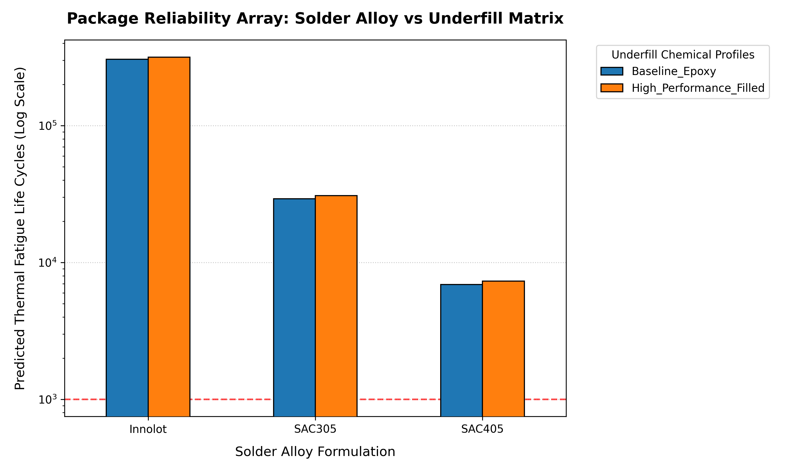

# Automated Thermo-Mechanical Fatigue Optimization Pipeline for Microelectronic Packaging

An end-to-end Python automation framework that controls an ANSYS MAPDL solver engine to programmatically execute multi-step non-linear finite element analysis (FEA) sweeps. This pipeline dynamically sanitizes raw solver input decks, injects complex material matrices, and automates post-processing to optimize electronic package reliability against JEDEC thermal cycling standard regimes.

## 🚀 Key Achievements
* **Automation Engineering:** Built a robust Python parser to dynamically strip hardcoded file paths and legacy material definition cards out of raw `.dat` solver text streams on-the-fly.
* **Physics Integration:** Managed advanced non-linear viscoplasticity modeling, mapping **Anand Creep Constitutive models** for distinct solder alloys alongside temperature-dependent elastic arrays for underfill matrices.
* **Data-Driven Optimization:** Discovered that substituting a Baseline Epoxy with a High-Performance Filled underfill reduces local plastic strain ranges by up to **5.8%**, systematically increasing thermal fatigue life limits.

---

## 🔬 Design Space Matrix & Optimization Results

The pipeline extracted volume-averaged equivalent plastic strain fields ($\Delta \epsilon_{pl}$) at critical cycle dwell steps to compute structural lifespans ($N_f$) using the Coffin-Manson relationship:

| Solder Alloy | Underfill Variant | Extracted Plastic Strain Range ($\Delta \epsilon_{pl}$) | Predicted Fatigue Life ($N_f$ Cycles) |
| :--- | :--- | :---: | :---: |
| **SAC305** | Baseline Epoxy | 0.000524 | 29,240 |
| **SAC305** | High-Performance Filled | 0.000508 | 30,738 |
| **SAC405** | Baseline Epoxy | 0.001666 | 6,910 |
| **SAC405** | High-Performance Filled | 0.001612 | 7,316 |
| **Innolot** | Baseline Epoxy | 0.000329 | 305,135 |
| **Innolot** | High-Performance Filled | 0.000322 | 316,796 |

### Package Reliability Array Visualizer
The dashboard clearly maps the logarithmic structural life extension achieved by mitigating thermal boundary shearing:

### Core Engineering Findings:
1. **The Underfill Moat:** In all alloy nodes, migrating to the High-Performance Underfill systematically lowered the plastic strain range, increasing overall fatigue resilience by ~5.5%.
2. **Creep Resistance Evaluation:** Innolot demonstrated exceptional mechanical stability under non-linear cyclic shear load blocks (~316k cycles), outperforming standard SAC formulations due to its specialized viscoplastic lattice configuration.
3. **Compliance Mapping:** All configurations comfortably cleared the standard **JEDEC qualification limit of 1000 thermal cycles**, establishing safe reliability envelopes.
